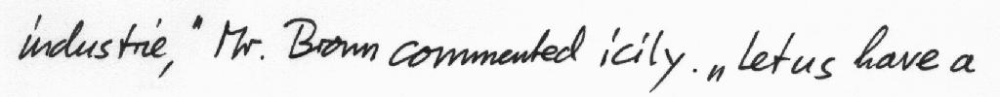

# Step-by-step Training Guide Using IAM Database

The IAM Handwriting Database contains forms of handwritten English text which
can be used to train and test handwritten text recognizers and to perform
writer identification and verification experiments.



This folder contains the scripts to reproduce my degree final work results which are directly related to those from the paper
"Are Multidimensional Recurrent Layers Really Necessary for Handwritten Text Recognition?", by Joan Puigcerver.

## Requirements
- [ImageMagick](https://www.imagemagick.org/):
  Needed for processing the images.
- [imgtxtenh](https://github.com/mauvilsa/imgtxtenh):
  Needed for processing the images.
- [Kaldi](https://github.com/kaldi-asr/kaldi):
  Needed to compute the decoding CER and WER.

## Pipeline

This section explains some details of the `run.sh` script, which will reproduce
the main experiments reported in the paper. If you are too lazy to read this
(or you are in a hurry), just type:

```bash
./run.sh
```

If you have not downloaded the IAM data before, you will need to provide your
username and password for FKI's webpage (see next section). You can specify
them through the `$IAM_USER` and `$IAM_PASS` environment variables.
For instance:

```bash
IAM_USER=your_username IAM_PASS=your_password ./run.sh
```

### Step 1. Download data.

The first step is to obtain the IAM dataset from the FKI's webpage. You'll need
to be registered in their website, in order to download it. Please, go to
http://www.fki.inf.unibe.ch/DBs/iamDB/iLogin/index.php and register.

One you have registered to the website, you can now download the data providing
your username and password to the `src/download.sh` script:

```bash
./src/download.sh --iam_user "$IAM_USER" --iam_pass "$IAM_PASS";
```

This will download the _lines_ partition of the dataset, where all the lines
from the original forms have been segmented, and the images will be placed
all together in the `data/original/lines` directory.
The script will also download the ASCII ground-truth of the dataset.

### Step 2. Prepare images.

Once you have downloaded the data, you are ready to process the line images
that will be used for training and testing your model. The image lines are
enhanced using [imgtxtenh](https://github.com/mauvilsa/imgtxtenh).
Skewing is also corrected using ImageMagick's convert. This tool is also used
to remove all white borders from the images and leaving a fixed size of
20 pixels on the left and the right of the image.

Finally, because our model requires that all input images have the same height,
all images are scaled to a fixed height of 128 pixels, while keeping the
aspect ratio.

```bash
./src/prepare_images.sh;
```

### Step 3. Prepare IAM text data.

You will also need to process the ground-truth in order to train the neural
network.

We will use (what we call) Aachen's partition of the dataset. Each set of
this partition has the following statistics:

- Train: 6161 lines from 747 forms.
- Validation: 966 lines from 115 forms.
- Test: 2915 lines from 336 forms.

This is not the official partition of the dataset, but it is widely used
for HTR experiments.

```bash
./src/prepare_iam_text.sh;
```

The ground-truth is processed in several ways to fix some of its
irregularities. First, some the characters of some words that were originally
separated by white spaces in the ground-truth are put together again
(e.g. "B B C" -> "BBC"). Secondly, the original data was trivially
(and unconsistently) tokenized by separating contractions from the words,
we put contactions attached to the word again (e.g. "I 'll" -> "I'll",
"We 've" -> "We've").

Once these irregularities have been fixed, the character-level transcripts
are produced by simply separating each of the characters from the word
and adding a `<space>` symbol to represent the whitespace character.

### Step 4. Train the neural network.

You are finally ready to train the neural network used in the final section
of the paper. Summarizing, the model consists of:

- 5 Convolutional blocks with 3x3 convolutions, LeakyReLU activations
  and batch normalization. The first 3 blocks include a MaxPooling layer,
  and the last 3 blocks use dropout with probability 0.2. The number of
  features in each block is 16, 32, 48, 64, and 80, respectively.
- 5 bidirectional LSTM recurrent layers with 256 hidden units and dropout with
  probability 0.5.
- A final linear layer with 80 output units (79 characters + CTC blank symbol).
- Training stops after 20 epochs without any improvement on the validation
  CER.


```bash
./src/train.sh;
```

This script will create several files in the `train` directory. If you are
continuing a previous experiment, the `--checkpoint` allows choosing a different
checkpoint than the best validation CER.

__IMPORTANT:__ Be aware that this script may take a considerable amount of time
to run (7h on a NVIDIA GTX 1080) and GPU memory (8GB). If this is not
feasible for you, reduce the batch size (the default is 10) by passing
`--batch_size $your_batch_size` to the script, and/or reduce the early stop
epochs with `--early_stop_epochs $your_max_stop_epochs` (the default is 20).

### Step 5. Decode using only the neural network.

Once the training is finished, you can obtain the transcript directly from
the neural network, using the CTC decoding algorithm. This algorithm simply
obtains the most likely label on each frame independently and then removes
repetitions of labels, and finally it removes the instances of the CTC blank
symbol.

The script `src/decode_net.sh` will use PyLaia to decode the validation and
test lines. Just type in your console the following command:

```bash
./src/decode_net.sh;
```

The expected results at this point on the validation and test sets are:

| Set    | CER (%) | WER (%) |
|:------ | -------:| -------:|
| Valid. | 4.7     | 16.3    |
| Test   | 7.6     | 23.8    |

## Any problem?

If you have any issue reproducing any results, please contact the
code owners at carlossmocholi@gmail.com or joapuipe@prhlt.upv.es.
